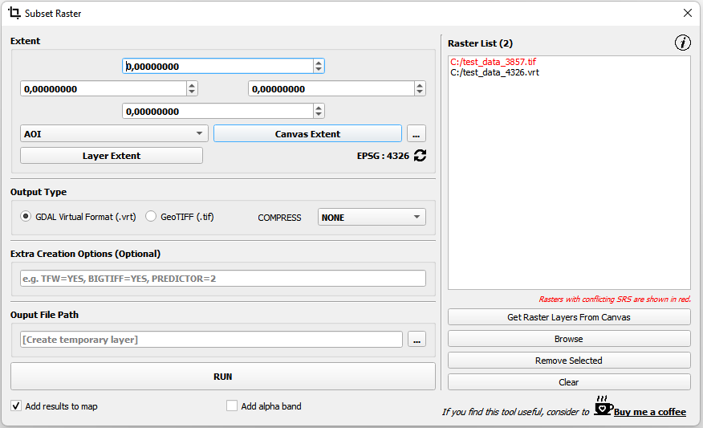

# QGIS Raster Divider Plugin

This plugin allows user to create subset of a raster quickly and easily. Two types of output formats are available (GeoTiff, VRT).
  

 
<b>Extent of Subset:</b> Specifies the extent of the subset area. <i>Layer Extent</i>, <i>Canvas Extent</i>, and <i>Manual Draw</i> options are available, and the extent coordinates can also be entered manually. The coordinate reference system (CRS) of the subset extent is displayed in the lower-right corner.
 

 
<b>Output  Type:</b> Output type and compression method is specified here.
 

 
<b>Overlap:</b> Overlap sizes of each tile are specified here.
 

 
<b>Overlap Strategy:</b> There are two options for overlapping. 

- <b><i>Auto</i></b> : In this method an auto overlapping is applied to tiles to make the subraster completely align with the original raster. For instance; if raster size is 1000 px and desired tile size is 150 px than 6 subraster would be generated with <b>100px residual</b>. In order to prevent this residual, subrasters are overlapped automatically even if the overlapping value is 0. If the overlapping value is set as a number greater than 0, subrasters are overlapped automatically <b>taking this value into account</b>.
  
